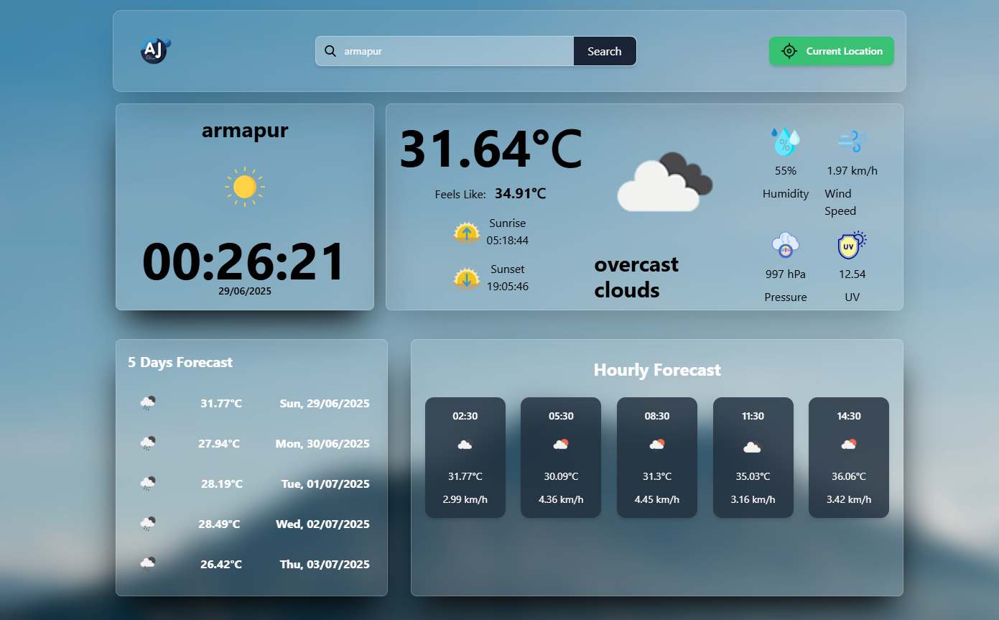

# 🌤️ Weather App

A clean, modern, and responsive weather app built using **HTML, CSS, React + Vite + Tailwind CSS**.  
It shows current weather, 5-day forecast, UV index, and more using real-time APIs.

🔗 **Live Site**: [https://weather-app-five-phi-17.vercel.app](https://weather-app-five-phi-17.vercel.app)

---

## 📸 Screenshots



---

## 🚀 Features

- 📍 Get weather by **current location** using geolocation  
- 🔍 Search weather by **city name**  
- 🌡️ Current temperature and weather description  
- 🌅 Sunrise & 🌇 Sunset times  
- 💧 Humidity, 💨 Wind speed, 🧭 Pressure  
- 🌞 UV Index using OpenUV API  
- ⏰ Live clock for local time  
- 📱 Fully responsive layout  
- ✨ Clean UI with glassmorphism effects using Tailwind CSS  

---

## ⚙️ Tech Stack

- React (Vite)  
- Tailwind CSS  
- Axios  
- React Toastify  
- OpenWeatherMap API  
- OpenUV API  
- Vercel (Deployment)  

---

## 📂 Folder Structure

```
weather-app/
├── public/
├── src/
│   ├── assets/            # Icons/images
│   ├── components/        # Reusable components
│   │   ├── CityAndTime.jsx
│   │   ├── Clock.jsx
│   │   ├── ForeCast.jsx
│   │   └── NavBar.jsx
│   ├── App.jsx
│   ├── main.jsx
│   └── index.css
├── .gitignore
├── README.md
├── package.json
├── postcss.config.js
├── tailwind.config.js
├── vite.config.js

```

# 🖥️ Run the App Locally

# 1. Clone the repository
git clone https://github.com/Mr-aj33t/Weather-App.git
cd Weather-App

# 2. Install dependencies
npm install

# 3. Run the app
npm run dev

## ✅ To-Do

- 🌎 **Add language & unit switch** (Celsius/Fahrenheit)  
- 📅 **Add date/time for forecast**  
- 📍 **Add location autocomplete** using Google Places or Mapbox  

## 🙌 Credits

- [OpenWeatherMap API](https://openweathermap.org/)
- [OpenUV API](https://www.openuv.io/)
- [React Toastify](https://fkhadra.github.io/react-toastify/)
- [Vercel](https://vercel.com/)
- [Tailwind CSS](https://tailwindcss.com/)

## 👋 Author

Made with ❤️ by **Ajeet**

